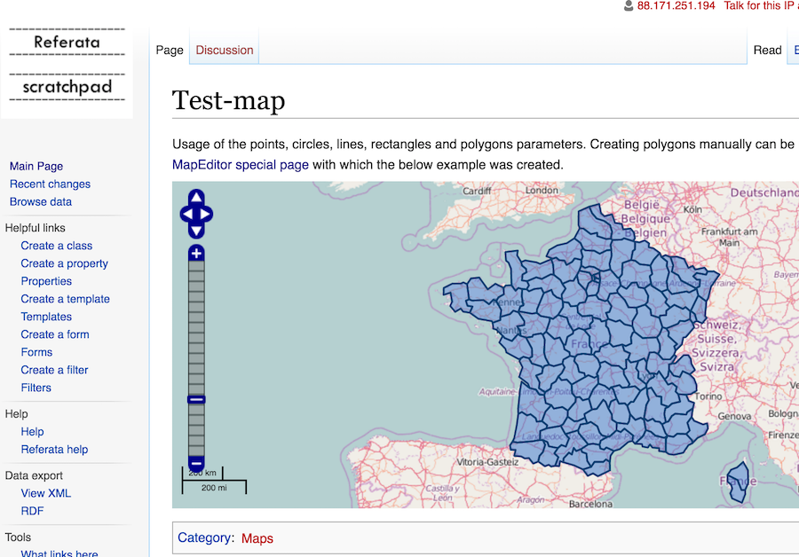

# shp2mediaWikiMaps
Transformation d'un shape en format maps mediawiki

Mediawiki propose une [extension Maps](ttps://www.mediawiki.org/wiki/Extension:Maps) qui permet l'affichage de cartes avec OpenLayers.

##Objectif
Transformer un fichier shapefile de référence (département par exemple) en géométries mediawiki/ext:maps

## Usage
```
shp2mediaWiki.py > sortie.txt
```
## Résultat

Visible [ici](http://scratchpad.referata.com/wiki/Test-map).
 

##Réprésentation d'une géométrie

#### Polygones
<pre>|polygons=48.8518406997,3.48504226201:49.0124891075,3.16744612724:49.1177940124,3.07199545707....</pre>
--> où [0]=latiture et [1]=longitude, séparateur : ",", délimiteur : ":"

#### Points

#### Autres informations
Après le polygon plusieurs arguments possibles comme le contenu de l'infobulle, couleurs du contour du remplissage...
<pre>polygons=48.8518406997,3.48504226201:...~Contenu InfoBulle~ ~#0B4173~ ~ ~#3373CC~ ~;</pre>

##Problématique du volume

La taille des polygones (la chaine de caractères) semble limitée... on doit réduire (à mort) le nombre de points qui consitue chaque polygone. 

##Simplification avec MapShader
C'est possible de simplifier un shapefile avec MapShaper, d'après mes tests, pour les départements il faut tomber à 1.4 % (du nombre de points ?) pour que la taille soit acceptable.

* http://www.mapshaper.org/
* https://github.com/mbloch/mapshaper/wiki/Command-Reference

##Liens

* Bac à sable : http://scratchpad.referata.com/wiki/Test-map
* Category:Maps examples (semantic mediawiki) : https://www.semantic-mediawiki.org/wiki/Category:Maps_examples 
* https://www.semantic-mediawiki.org/wiki/Maps_examples/Google_Maps_polygons_on_hover
* Mediawiki Extension:Maps : https://www.mediawiki.org/wiki/Extension:Maps
* Mediawiki Maps examples/Geocode : https://www.semantic-mediawiki.org/wiki/Maps_examples/Geocode
* Editeur de carte : https://www.semantic-mediawiki.org/wiki/Special:MapEditor

